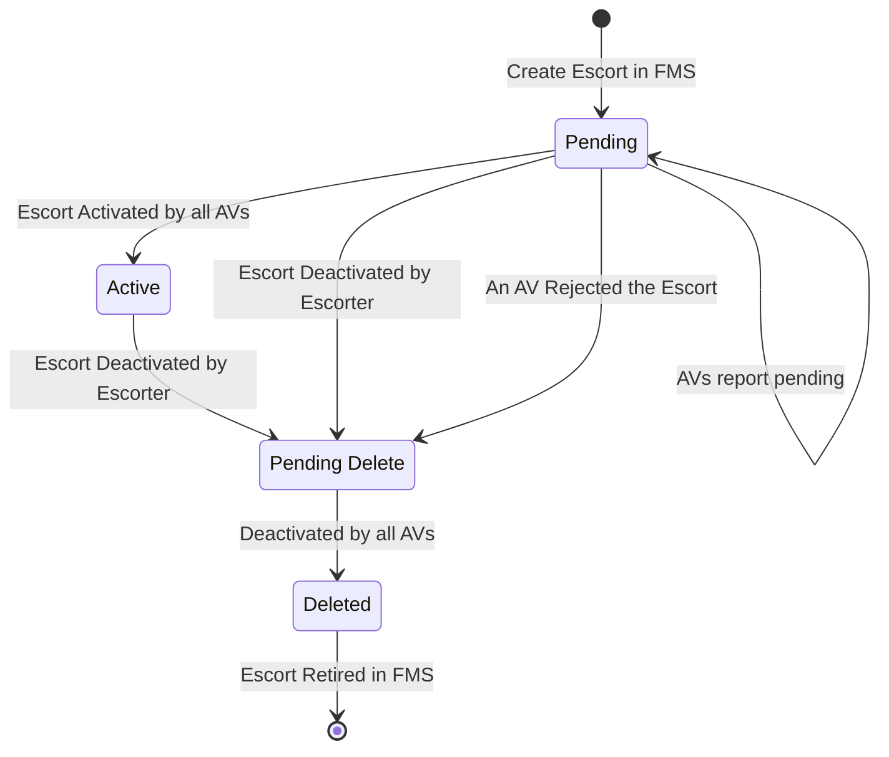

# Escort 
The Escort feature allows non-instrumented equipment to safely travel in the autonomous operating zone by being escorted by a staffed instrumented vehicle. The non-instrumented equipment is protected by always being inside a zone behind the instrumented vehicle, communicated to all autonomous vehicles.
 
This repository defines the **messages and communication protocol between the Fleet Management System (FMS) and the Autonomous Haulage System (AHS)** for activating and deactivating escorts.
 
## Terminology
| Term | Description |  
| --- | --- |  
| AHS | Autonomous Haulage System |  
| AV | Autonomous Vehicle |  
| FMS | Fleet Management System |  
| AOZ | Autonomous Operating Zone. The area where the autonomus mining vehicles are allowed to operate. |
| SIV | Staffed Instrumented Vehicle. Manually driven equipment equipped with a remote stop. Could be a car, an excavator, or any other type of moving equipment. |
| Escorter | The leading SIV during the escort activity. |
| Escortee | A non-instrumented vehicle being escorted. |
| Escorting convoy | The escorter together with its escortee(s) |
| Escort Protection Zone | The zone in which the escorting convoy is required to be within at all times. Is defined by a configurable distance that extends behind the escorter, to include the escortee. |
| Escort Avoidance Zone | Zone internally defined on each AV, that the AV will not enter. It is at least as big as the protection zone, but is likely bigger due to latency of the escorter's position updates. |

## Operational Requirements
For the system to function as intended, the following driving behaviours must be adhered to:

### All parties shall:
- Adhere to the traffic rules specified by the map

### The ```Escorter``` must:

- Adhere to the speed limit specified at the time of creation
- Drive in such a manner as to ensure the 'Escortee/s' can follow within the 'Length' of the escort

### The ```Escortee``` must:

- Always follow the path of the Escorter at a safe driving distance
- Follow the Escorter, as closely as possible, within the bounds of a safe distance
- When on roads, the Escorter shall follow within the boundaries of the lane
- When in open areas, the Escorter shall follow within the boundaries of the 'Width' of the escort
- If the Escorter stops, the Escortee shall pull up directly behind, within the bounds of a safe distance.

> [!IMPORTANT]
> - The Escortee must at all times stay within the defined Protection Zone.
> - The AV will in its escort predictions assume that an Escort Convoy that is driving on a road will keep driving on the road and within the lane. Therefore it is important that the Escort Convoy actually does that.

> ![Warning]
> Failure to adhere to the specified driving behaviours could result in loss of protection provided by the system.


### Escorting SIV Requirements
The typical use case expects the Escorter SIV to be a light vehicle.

#### Minimum requirements for the instrumentation are that it has the ability to:
- Determine its position with a precision measurement
- Network connection to the FMS

#### Optional:
- Connection to secondary network layer (e.g. V2X)


## System Limitations

The Escort system cannot accommodate oversized vehicles. Oversized vehicles are defined as vehicles that meet any of the following conditions:

- Block both lanes of traffic
- Cannot remain within a single lane for the entire journey
- For any reason, cannot adhere to the road rules specified by the map


## General Operation Description

### Escort Initiation
The Escorter and the Escortee line up at a safe place near or within the AOZ. The Escorter requests a new escort and the FMS communicates this to all active autonomous vehicles.

### Activation
When all AVs have activated the escort, the Escorter receives confirmation from the FMS that the escort is operational.

### Active Protection
Each AV must account for the escort's position and avoid entering its protection zone. Due to transmission delays, AVs expand their internal representation (Avoidance Zone) to cover all possible movements of the escort since the last position update.

> ![Note]
> The safety case does not require position updates once the escort is activated. However, because of the expanding avoidance zone the overall system performance will be better with more frequent and less delayed position updates.


## Escort Protection Zone Specification  
Escort protection zones are defined and exchanged using this protocol. The zones are dynamically shaped based on both **escort-defined parameters** and **real-time operating conditions**:

### Parameters
These parameters are part of the activation request, during the active escort phase the parameters are constant througout the entire escort operation.
- **Length**: The Escortee must always stay within _length_ meters of the Escorter along the path that the Escorter is driving.
- **Width**: Configured by the Escorter vehicle, applicable to escorting in open areas. When driving on road the escort must always stay within the lane, and the entire lane width will constitute the protection zone.


### Real-Time Operating Conditions
Once an escort is activated, the Escorter vehicle continuously transmits its position at **1 Hz (one update per second)**. These periodic updates allow AVs to maintain a limited Avoidance Zone.

### Escort Prediction
Since each AV must predict each escort's possible position since its last postion update there has to be a defined predictor behaviour.

The AV will assume that:
- The Escort drives at any speed up to the maximum allowed according to the map.
- If the Escort is on a road the AV will assume:
  - The Escort is not reversing in the lane.
  - The Escort is staying within the lane and never crosses into any opposing lanes.
  - If the lane splits the Escort could have taken any of the allowed splits.
- If the Escort is within an open area the AV will assume:
  - The Escort is not reversing.
  - The Escort may do any possible* forward driving within the Open Area.

*Within some vehicle dynamics limitations.


## Escort Operation State Machine  
Escorts follow a lifecycle managed through the FMS–AHS communication:  

- `Pending`: The escort operation has been announced but has not been activated by all operating AVs.  
- `Active`: The escort operation is active and enforced by all operating AVs.  
- `Deleted`: The escort operation has been removed and is no longer enforced.  



> [!NOTE]  
> Immutable attributes (e.g., escort vehicle ID, length and width [TBD - Station ID (V2X ID)], communication configuration) cannot be changed on an active zone. To update them, a new escort zone must be created, and the old one must be retired.  

---

## Sequence Diagrams  
See [Sequence Diagrams](diagram/SequenceDiagrams.md) for scenarios illustrating the interactions between FMS, AHS, and AV when creating, activating, updating, and removing escort zones.  

---

## Communication Protocol  
All communication between the FMS and AHS for managing escort zones is handled through a **single persistent WebSocket connection**.  

This connection must satisfy the following requirements:  
- The connection is continuously monitored from both ends.  
- Messages are exchanged asynchronously over the connection.  
- Escort position updates are streamed at **1 Hz** while the escort is pending or active.  
- If the connection is lost, the following applies:  
  - The connection must be reestablished **as soon as possible**.  
  - Once the connection is restored, the Avoidance Zone contracts back to its configured dimensions.  

---

## Failure Handling  
Because escort zones are safety-critical, the protocol defines explicit behavior for failures:  

- **Connection loss**: Triggers immediate reconnection attempts and automatic safety expansion of the escort zone.  
- **Delayed updates**: Avoidance Zone expands in proportion to the escort’s speed and elapsed time since last update.  
- **Recovery**: Normal zone dimensions are restored as soon as updates resume.  

---

 