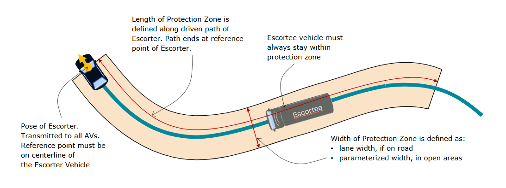
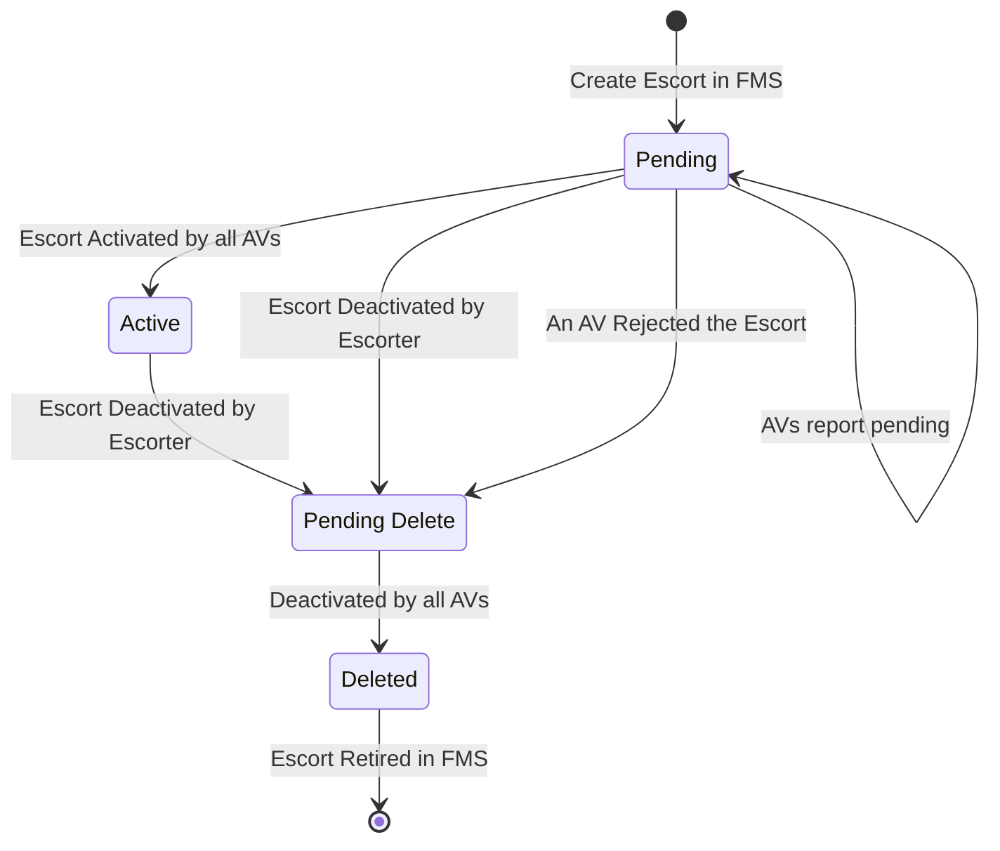
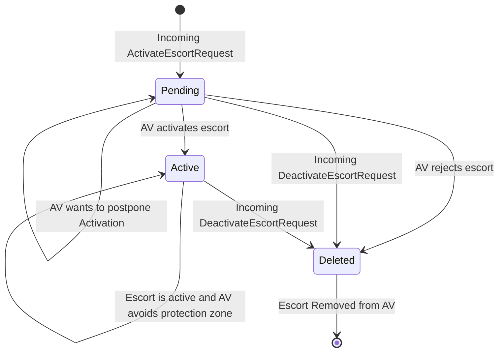

# Escort Protocol Overview

This document specifies an open standard interface for the operation of staffed vehicle escorts that enable non‑instrumented equipment to safely traverse an Autonomous Operating Zone (AOZ). Safety is achieved by keeping the escorted equipment (Escortee) continuously inside a dynamically enforced protection zone trailing a staffed instrumented lead vehicle (Escorter). All Autonomous Vehicles (AVs) receive and respect this zone via the Fleet Management System (FMS) to the Autonomous Haulage System (AHS) communication channel.

The repository defines the normative message set and communication behaviors between the Fleet Management System (FMS) and the Autonomous Haulage System (AHS) for the life cycle of an escort (creation, activation, operation, and deactivation).

## Scope
This specification covers:
- Terminology and roles
- Operational and instrumentation requirements
- Zone geometry and prediction assumptions
- Escort life cycle state machine semantics
- Communication transport requirements
- Failure handling rules

Out of scope:
- Detailed AV internal planning algorithms
- Human‑machine interface (HMI) design
- Map data format

## Table of Contents
1. [Scope](#scope)
2. [Terminology](#terminology)
3. [Operational Requirements](#operational-requirements)
4. [Instrumentation Requirements (Escorting SIV)](#instrumentation-requirements-escorting-siv)
5. [System Limitations](#system-limitations)
6. [General Operation](#general-operation)
7. [Protection Zone Specification](#protection-zone-specification)
8. [Prediction Model](#prediction-model)
9. [Operation State Machine](#operation-state-machine)
10. [Sequence Diagrams](#sequence-diagrams)
11. [Communication Protocol](#communication-protocol)
12. [Glossary Consistency Notes](#glossary-consistency-notes)

## Terminology
| Term | Description |
| --- | --- |
| AHS | Autonomous Haulage System |
| AV | Autonomous Vehicle |
| FMS | Fleet Management System |
| AOZ | Autonomous Operating Zone – geographic area within which autonomous mining vehicles are permitted to operate. |
| SIV | Staffed Instrumented Vehicle – manually operated equipment equipped with required instrumentation (e.g. positioning, remote stop). |
| Escorter | The leading SIV responsible for defining and transmitting the escort protection zone. |
| Escortee | The non‑instrumented vehicle (or vehicles) being escorted. |
| Escort Convoy | The Escorter together with all associated Escortees. |
| Protection Zone | The geometric zone that the Escort Convoy shall remain within; extends behind the Escorter to encompass all Escortees. |
| Avoidance Zone | A zone derived and maintained internally by each AV; the AV shall not enter it. It is never smaller than the Protection Zone and may be enlarged due to update latency. |

## Operational Requirements
The following operational behaviors are mandatory to ensure the integrity of the escort safety concept.

### All Parties Shall
- Adhere to map‑defined traffic rules and constraints.

### Escorter Shall
- Adhere to the configured speed limit for the escort.
- Drive so that all Escortees can remain within the defined Protection Zone Length.
- Maintain predictable lane compliance when operating on roads.

### Escortee Shall
- Follow the Escorter path at a safe, forward, non‑reversing distance.
- Remain within lane boundaries when on roads.
- Remain within the configured Width when in open areas.
- Stop directly behind the Escorter within a safe distance if the Escorter stops.

> [!IMPORTANT]
> - Escortees must remain inside the Protection Zone at all times.
> - Prediction assumes road travel remains within the originating lane; deviations invalidate optimal avoidance performance.

> [!WARNING]
> Failure to comply with these requirements can result in loss of system‑provided protection.

## Instrumentation Requirements (Escorting SIV)
The typical Escorter is a light vehicle (e.g. a car). Minimum instrumentation capabilities:
- Precision position determination (meeting site accuracy criteria).
- Reliable bidirectional network connectivity to FMS.

Optional capabilities:
- Secondary communication channel (e.g. V2X) for enhanced performance.

## System Limitations
Oversized vehicles are not supported. A vehicle is considered oversized if it:
- Occupies or blocks both lanes of a two‑lane road segment.
- Cannot remain fully within a single lane for the escort duration.
- Cannot comply with map‑defined traffic rules.

## General Operation

### Initiation
Escorter and Escortee(s) position at a safe staging location near or within the AOZ. Escorter issues an escort creation request. FMS distributes the escort definition to all active AVs.

> [!NOTE]
> Safe staging location within AOZ requires another layer of protection since it will not be safe by the escort mechanism until the escort is activated.

### Activation
Each AV acknowledges activation. When all required AV acknowledgments are received, FMS reports the escort as Active to the Escorter.

### Active Operation
AVs incorporate the Protection Zone into their planning and shall not enter the Avoidance Zone. Due to message latency, each AV expands its Avoidance Zone to encompass all feasible Escorter movement since the last received position update.

> [!NOTE]
> While continuous position updates post‑activation are not strictly required for baseline safety, higher update frequency reduces Avoidance Zone expansion and improves overall system performance.

### Deactivation
Escorter and Escortee(s) position at a safe staging location near or within the AOZ. Escorter issues an escort deactivation request. FMS distributes the escort deactivation to all active AVs.

## Protection Zone Specification
Protection Zones are parameterized during escort creation and are immutable for the active escort instance.

### Parameters
- Length: Maximum longitudinal trailing distance within which all Escortees must remain behind the Escorter along its driven path.
- Width: Lateral extent used in open areas. On roads, lane boundaries supersede Width and define the Protection Zone lateral limits.

### Real‑Time Updates
Escorter position is transmitted nominally at 1 Hz (one update per second) while Pending or Active. AVs use these updates to constrain expansion of the Avoidance Zone.

## Prediction Model
Each AV shall predict possible Escorter positions between updates according to these assumptions:
- On roads:
  - Escorter speed may be any value up to OnRoadSpeedLimit defined in the activate request.
  - No reversing within a lane.
  - Lane adherence; no crossing into opposing lanes.
  - At legal splits, any permitted branch may be chosen.
- In open areas:
  - Escorter speed may be any value up to the map‑defined maximum for the current open area.
  - No reversing.
  - Any forward trajectory consistent with vehicle dynamics within the configured Width and site constraints may be taken.

## Operation State Machine
Escort lifecycle states exchanged between FMS and AHS:
- Pending: Escort announced; activation acknowledgments outstanding.
- Active: Escort fully acknowledged; zone enforcement in effect.
- Deleted: Escort retired; zone no longer enforced.
- Pending Delete: The escort operation has been marked for deletion but has not yet been removed by all operating AVs.

### State Machine In FMS

### State Machine In AV

> [!NOTE]
> Immutable attributes (Escorter vehicle ID, Length, Width, communication mode, and any future station identifiers) shall not be modified while Active. To change them, create a new escort and retire the existing one.

## Sequence Diagrams
Refer to [sequence diagrams](diagram/SequenceDiagrams.md) for interaction flows covering creation, activation, updates, and retirement.

## Communication Protocol
Escort management messages are exchanged between FMS and AHS.

Requirements:
- Continuous health monitoring by both endpoints.
- Asynchronous, non‑blocking message exchange.
- Position updates at 1 Hz during Pending and Active states.
- Rapid reconnection following any connection loss.

## Glossary Consistency Notes
- Use “Escorter” (capitalized) and “Escortee” consistently.
- “Protection Zone” refers to the convoy zone; “Avoidance Zone” is the AV internal safety buffer.
- Normative verbs: “shall” for mandatory, “may” for optional capability, “should” for recommended optimization.

---
Copyright (c) Contributors. Licensed under the terms in `LICENSE`.

 
