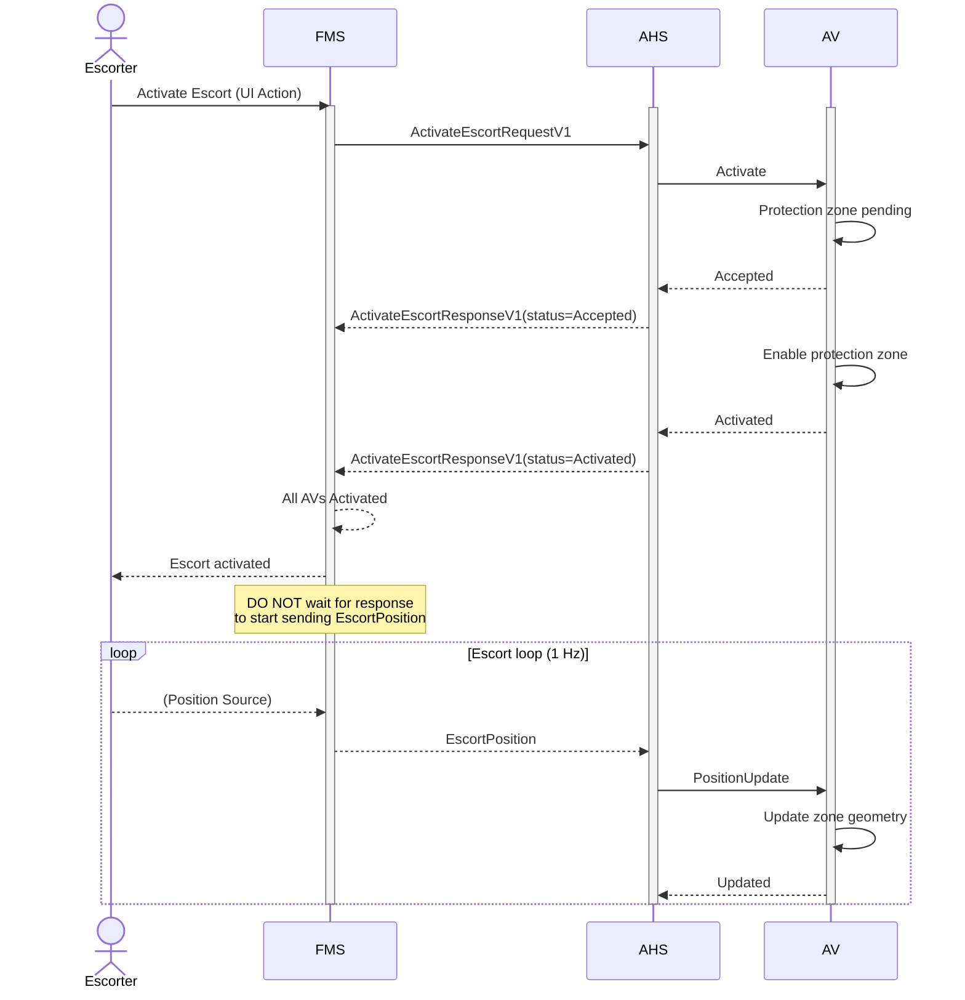
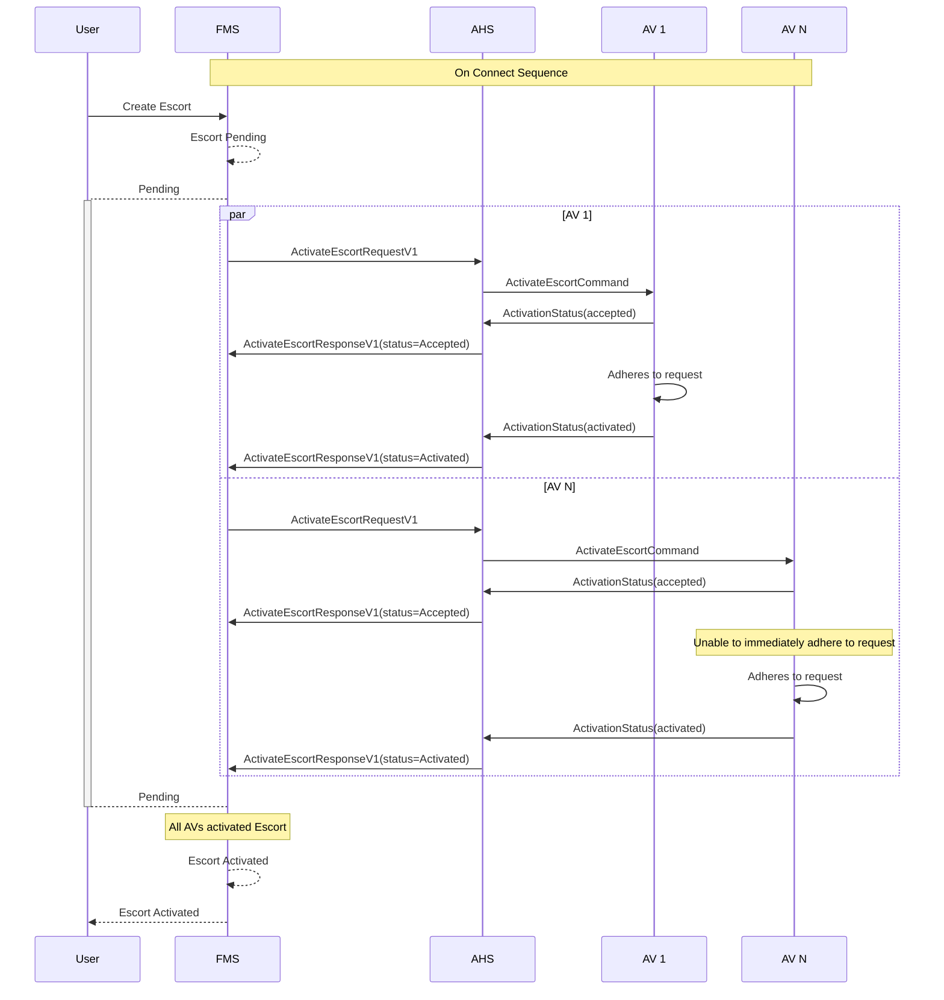
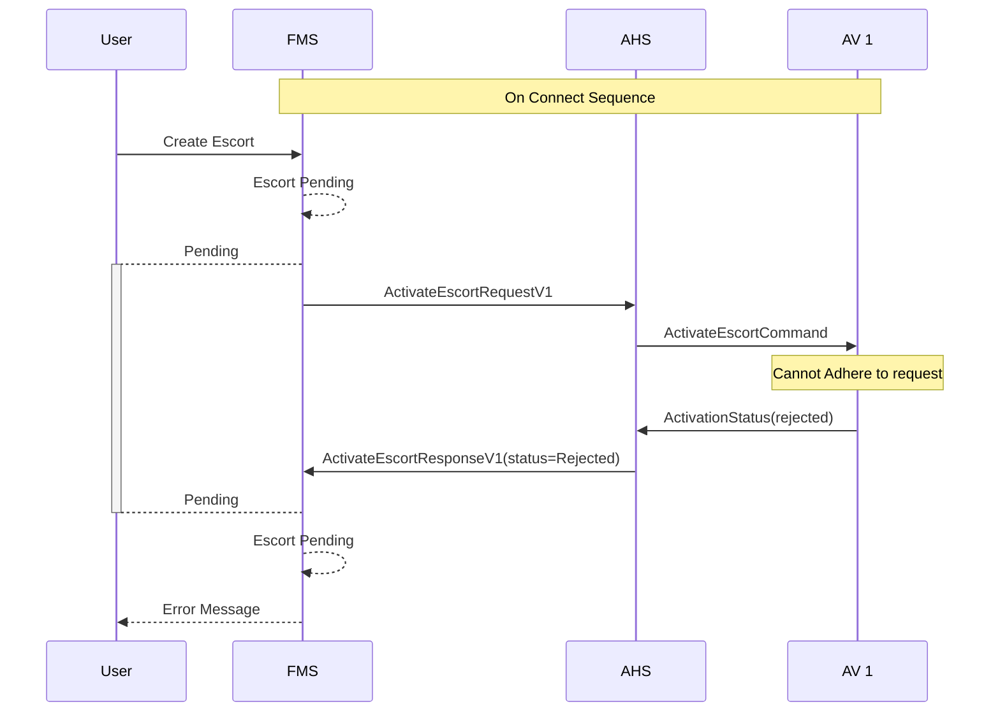

# Escort Activation
When an escort is created, the Fleet Management System (FMS) initiates the activation process by sending `ActivateEscortRequestV1` messages to the Autonomous Haulage System (AHS) for each of the Autonomous Vehicles (AVs) defined in the Fleet Definition. The AHS then communicates with each of the AVs to activate the escort internally. This document now also includes the full life cycle: activation attempts, steady‑state position pulsing, and deactivation.

> [!IMPORTANT]
> All systems shall implement idempotency when managing Escort Activations.

## Escort Overview Flow

> [!TIP]
> FMS must begin streaming position updates immediately after sending the activation request; waiting for an Accepted / Activated response can reduce safety margins.

## Typical Escort Activation

> [!TIP]
> The 2-step activation confirmation helps the system avoid unnecessary retries and allows for better transparency to be provided to the user. Accept allows the AV to respond to the request immediately, even if it cannot adhere to the request immediately. Activate is used to confirm when the request is being adhered to.

## Escort Activation Rejection
When an AV cannot adhere to the request defined in the escort definition, the AHS should send a `"Rejected"` status in the `ActivateEscortResponse` message to FMS. The FMS will then notify the user accordingly.

> [!NOTE]
> If an AV rejects the `ActivateEscortRequestV1` message for a given escort, the escort will not be activated within the FMS and will remain as `"pending"` until all AVs have successfully activated the escort.

