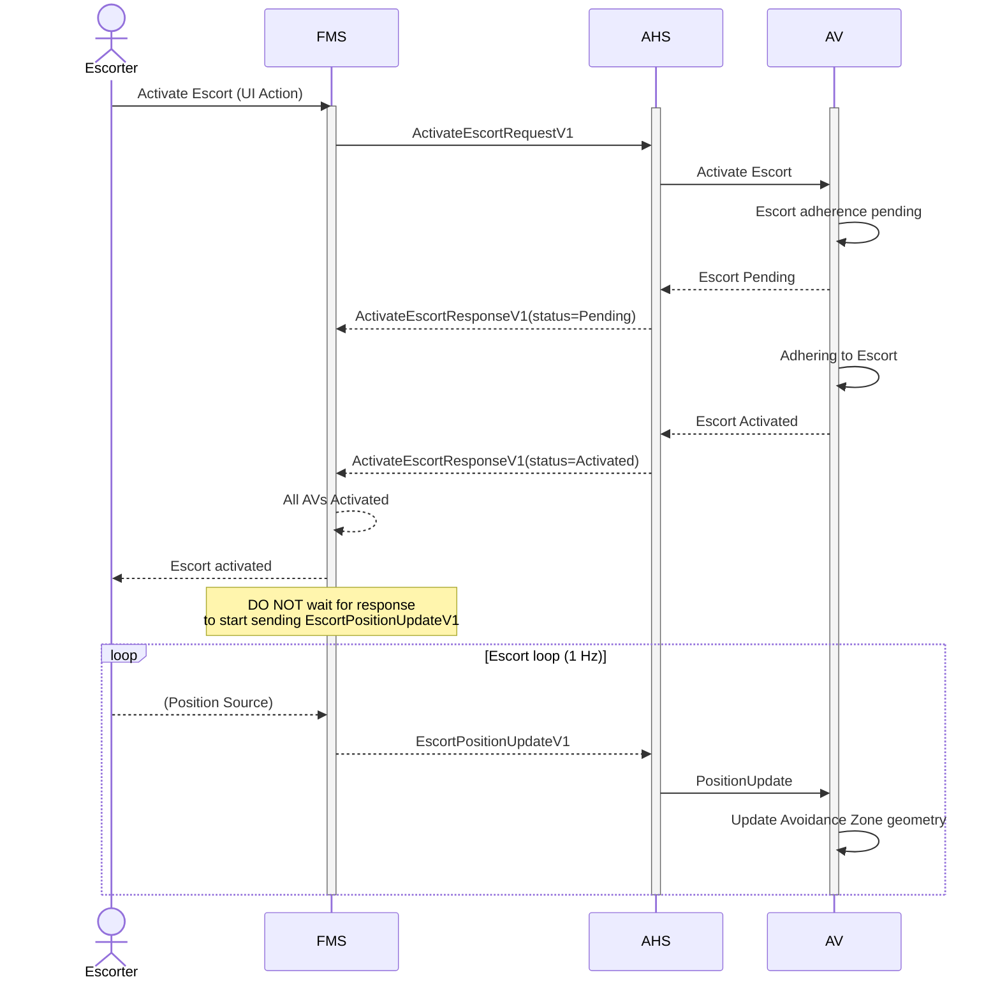
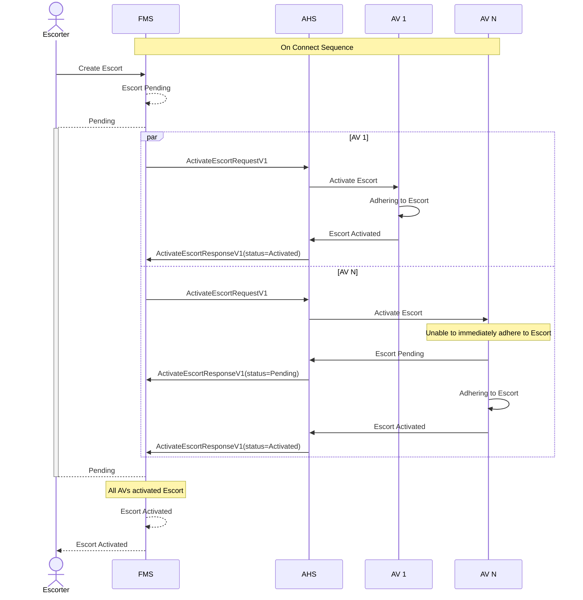
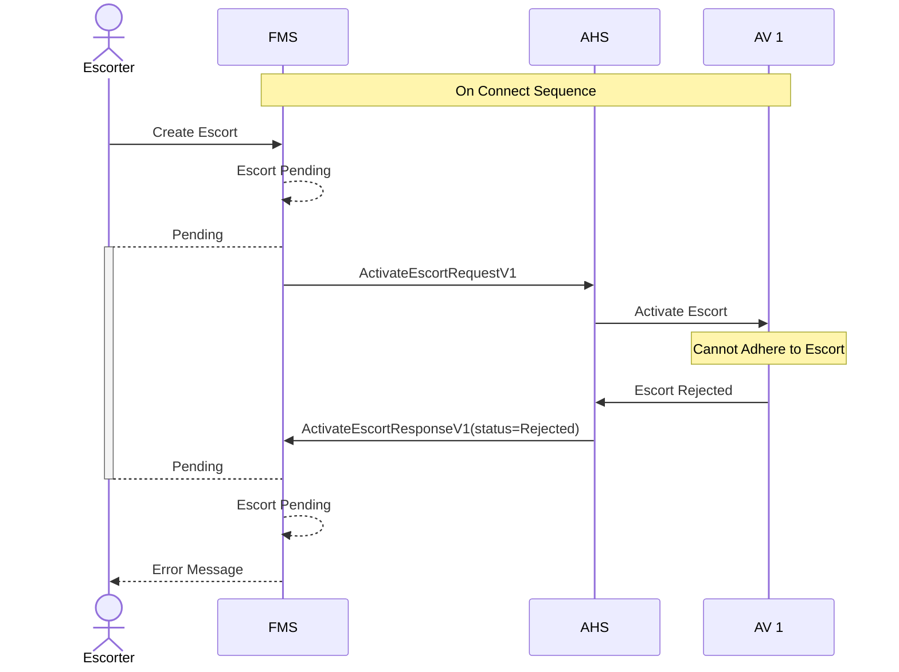

# Escort Activation
When an escort is created, the FMS initiates the activation process by sending [ActivateEscortRequestV1`](/specification/V1/ActivateEscortRequestV1.md) messages to the AHS for each of the AV defined in the  [Fleet Definition](/specification/V1/FleetDefinitionV2.md). The AHS then communicates with each of the AVs to activate the escort internally. This document includes the full life cycle: activation attempts, steady‑state position pulsing, and deactivation.

> [!IMPORTANT]
> All systems shall implement idempotency when managing Escort Activations.

## Escort Overview Flow

> [!IMPORTANT]
> FMS should begin streaming position updates immediately after sending the activation request, since the position information is required for AVs to activate the escort.

## Typical Escort Activation
AV 1 can adhere to the escort immediately, AV N can not.

> [!TIP]
> The 2-step activation confirmation helps the system avoid unnecessary retries and allows for better transparency to be provided to the user. Status Pending allows the AV to respond to the request immediately, even if it cannot adhere to the request immediately. Status Activate is used to confirm when the request is being adhered to.

## Escort Activation Rejection
When an AV cannot adhere to the request defined in the escort definition, the AHS should send a `"Rejected"` status in the [ActivateEscortResponse](/specification/V1/ActivateEscortResponseV1.md) message to FMS. The FMS will then notify the user accordingly.

> [!NOTE]
> If an AV rejects a given escort, it will never activate it.

