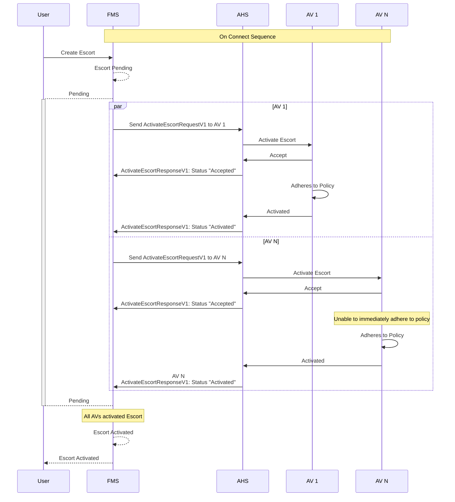
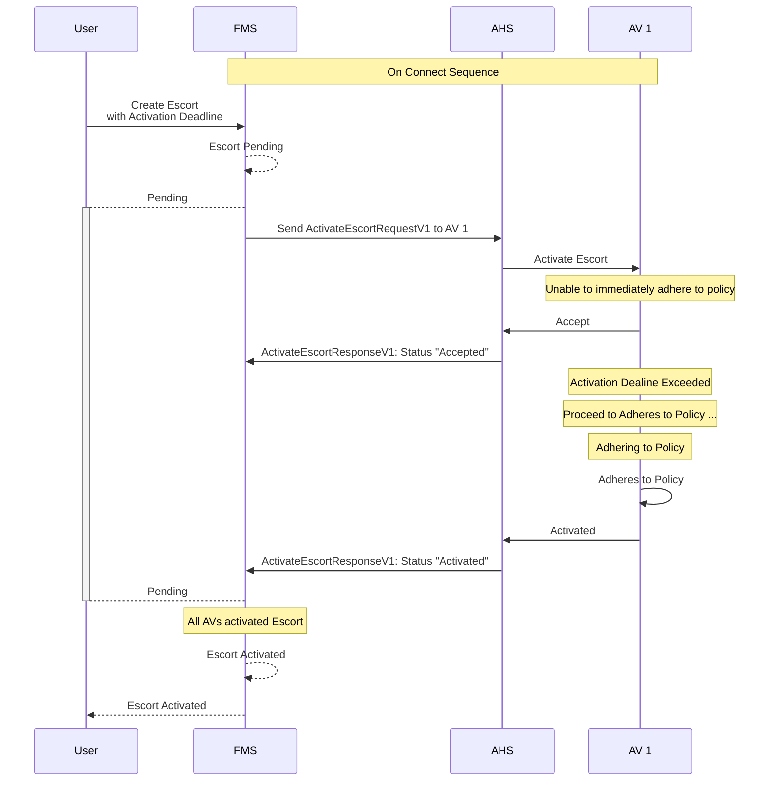
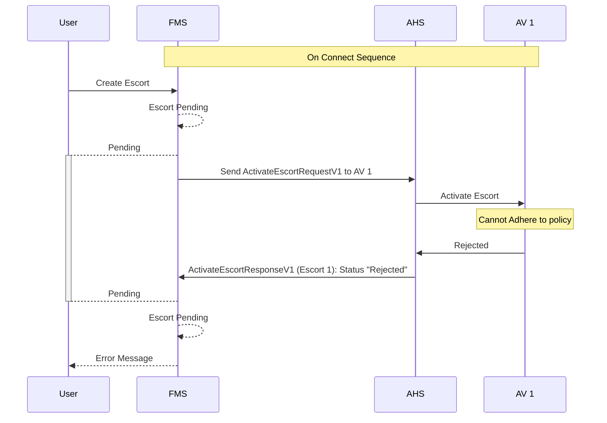

# Escort Activation
When a escort is created, the Fleet Management System (FMS) initiates the activation process by sending `ActivateEscortRequestV1` messages to the Autonomous Haulage System (AHS) for each of the Autonomous Vehicle (AV)s defined in the Fleet Definition. The AHS then communicates with each of the AVs to activate the escort internally. The following sequence diagram illustrates this process.

> [!IMPORTANT]
> All systems shall implement idempotency when managing Escort Activations.

## Typical Escort Activation

> [!TIP]
> The 2-step activation confirmation helps the system avoid unnecessary retries and allows for better transparency to be provided to the user. Accept allows the AV to respond to the request immediately, even if it cannot adhere to the policy immediately. Activate is used to confirm when the policy is being adhered to.

## Escort Activation Deadline Exceed
The escort can be created with the `activationDealine` property. This field is an indicative field that lets the AV know it should start to adhere to the policy if possible. However, it is not a strict demand and the AV is allowed to defer compliance up until the specified time. Once the activation deadline is reached, the AV must make best effort to adhere to the policy. Once the AV is adhereing to the policy, it should send its policy Acivation response.

> [!NOTE]
> The inclusion of the activation deadline does not change the activation process from the perspective of the FMS. For the FMS to consider the escort active, the FMS still needs to receive confirmation from all AVs that the escort has been activated.

> [!TIP]
> Activation deadlines let the user create a escorts as 'exit only' while the escort is transitioning from Pending to Active. This helps reduce the need to manually manage traffic during the transition stage when creating a escort.

## Escort Activate Rejection
When an AV cannot adhere to the policy defined in the escort definition, the AHS should send a `"Rejected"` status in the `ActiveEscortResponse` message to FMS. The FMS will then notify the user accordingly.

> [!NOTE]
> If an AV rejects the `ActivateEscortRequestV1` message for a given escort, the escort will not be activated within the FMS and will remain as `"pending"` until all AVs have successfully activated the escort.

