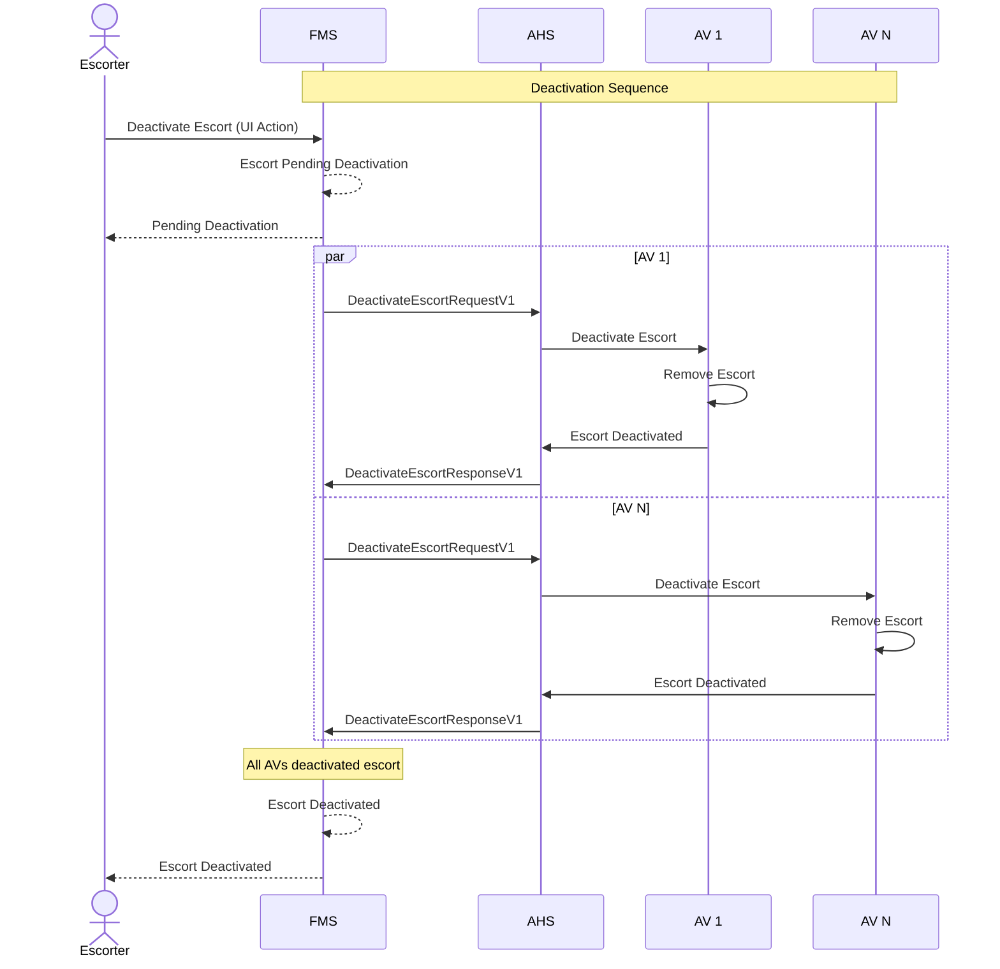
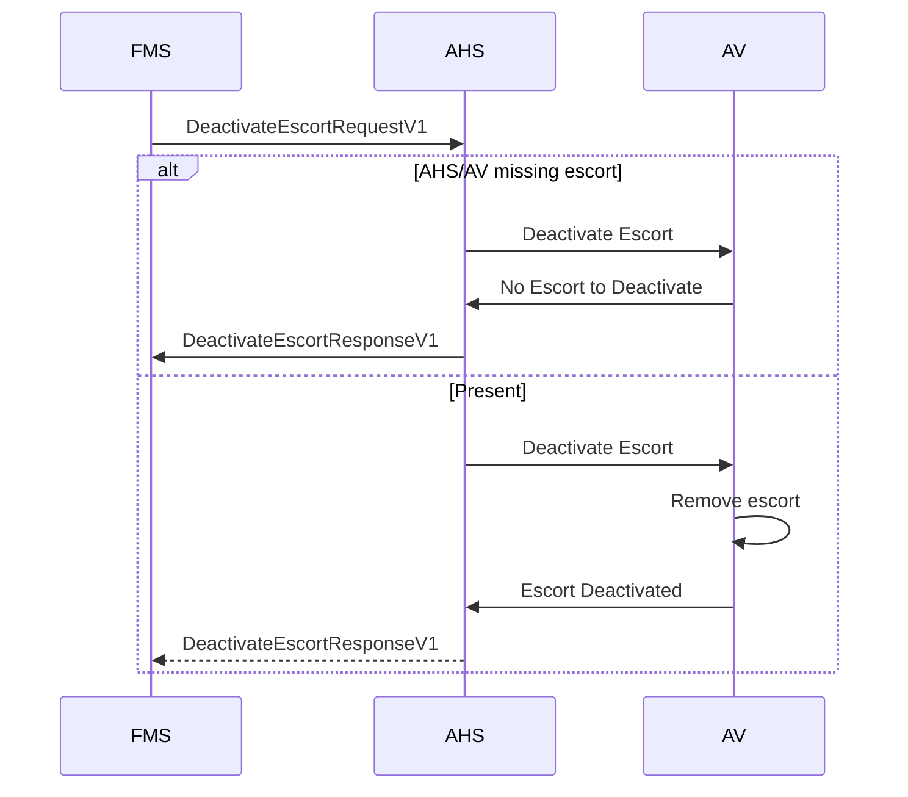

# Escort Deactivation
When an escort is deactivated, the FMS sends a request to the AHS to deactivate the escort on all AVs that are currently adhering to it. The AHS then communicates with each AV to remove the active escort zone.

> [!IMPORTANT]
> - All systems shall implement idempotency when managing Escort Deactivations.
> - To avoid unmanageable synchronization failures, AVs should accept Escort Deactivations for escorts that are unknown or already removed in AV memory (treat as success / NoOp).

Assuming the escort already exists in the FMS

## Out-of-Sync Deactivation Handling

