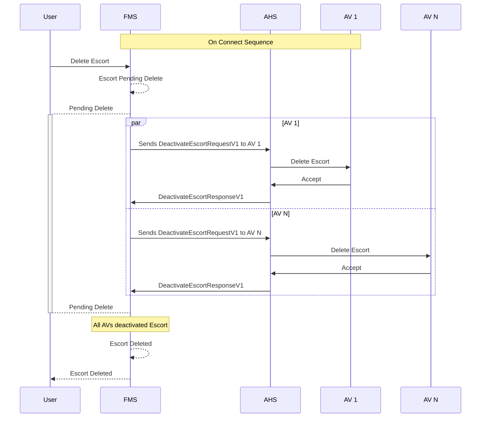

# Escort Deletion
When a escort is deleted, the Fleet Management System (FMS) will send a request to the Autonomous Haulage System (AHS) to deactivate the escort on all Autonomous Vehicles (AV) that are currently adhering to it. The AHS will then communicate with each AV to deactivate the escort.

> [!IMPORTANT]
> - All systems shall implement idempotency when managing Escort Deletions.
> - To avoid unmanagable synchronization failures, AVs should accept Escort Deletions for escorts that do not exist in the AVs memory.

Assuming the escort already exists in the FMS

