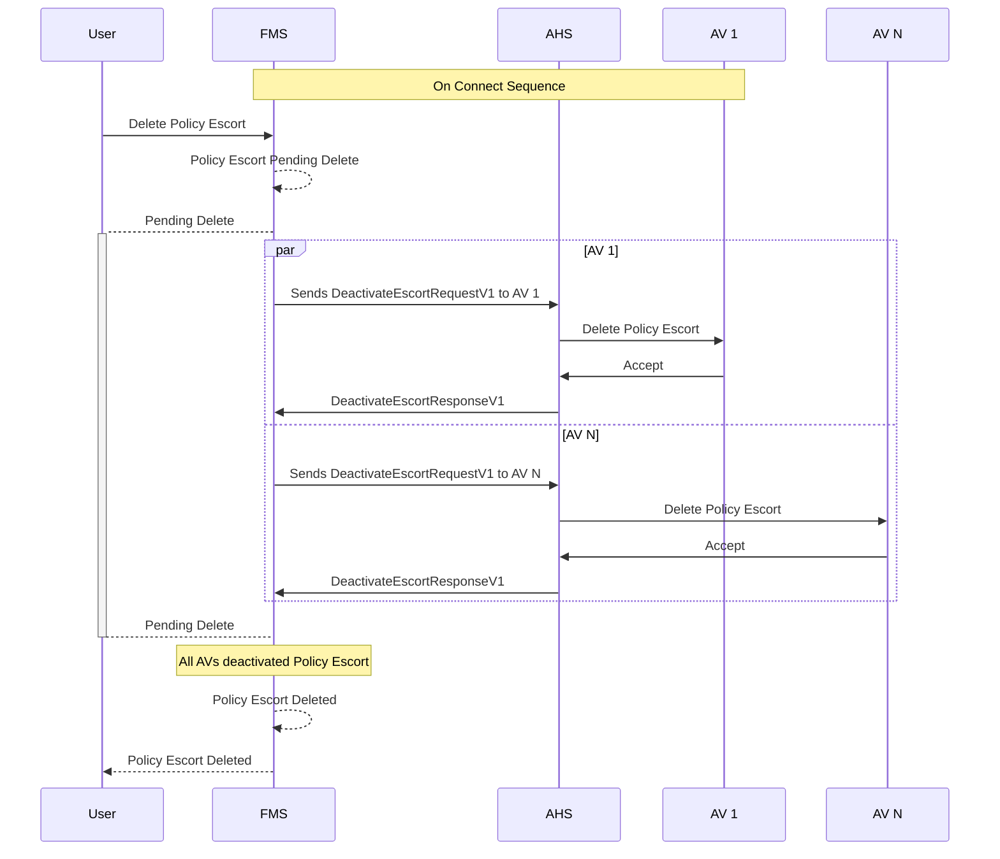

# Policy Escort Deletion
When a policy escort is deleted, the Fleet Management System (FMS) will send a request to the Autonomous Haulage System (AHS) to deactivate the policy escort on all Autonomous Vehicles (AV) that are currently adhering to it. The AHS will then communicate with each AV to deactivate the policy escort.

> [!IMPORTANT]
> - All systems shall implement idempotency when managing Policy Escort Deletions.
> - To avoid unmanagable synchronization failures, AVs should accept Policy Escort Deletions for escorts that do not exist in the AVs memory.

Assuming the policy escort already exists in the FMS

