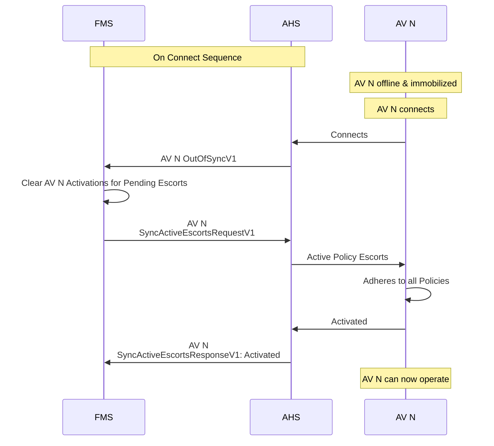
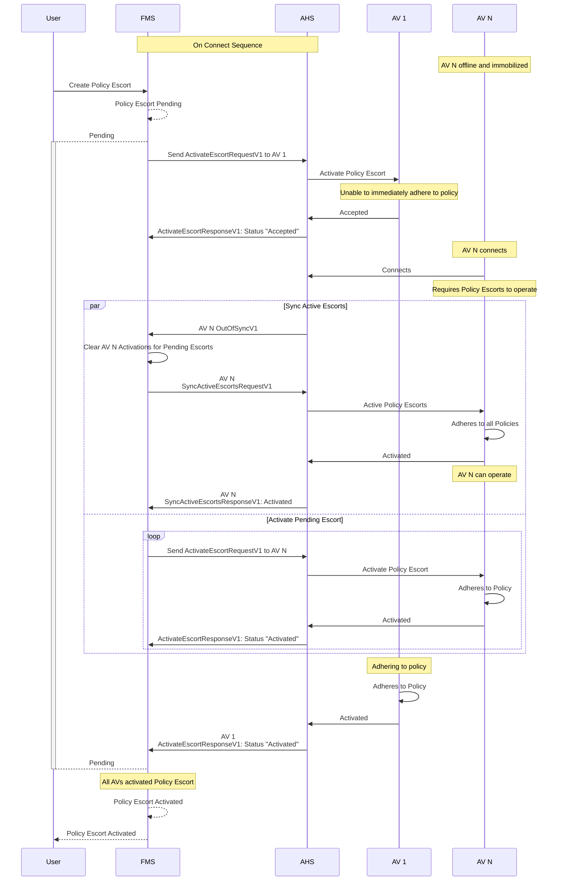
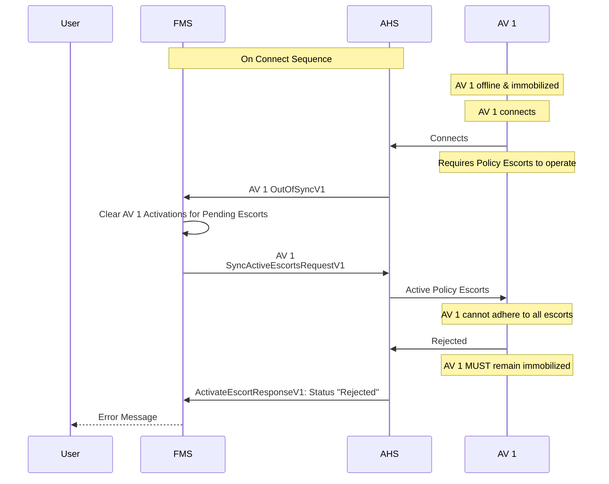

# Synchronization

Synchronization is required whenever an Autonomous Vehicle (AV) connects to the Autonomous Haulage System (AHS).

> [!IMPORTANT]
>- AVs shall be immobilized when their onboard policy escorts are not synchrnised with the FMS.
>- The AHS shall monitor the connection to each AV, and synchronization must also occur on re-connection after all lost communications events.


When an AV connects to the AHS, it shall send an `OutOfSyncV1` message to the Fleet Management System (FMS). This message indicates that the AV cannot guarantee that it has an up-to-date list of active policy escorts, and requires the FMS to send the current set of active escorts through a `SyncActiveEscortsRequestV1`. While the AV is out of sync, the AV shall be immobilized until it has received and internally activated these escorts.

## Typical AV Connects


> [!IMPORTANT]
> The FMS must 'Clear AV N Activations for Pending Escorts' after receiving an OutOfSync from 'AV N' because it needs to assume that 'AV N' has lost or cleared its orinternal memory.

## AV Connects With New Pending Escort
When an AV connects while a new policy escort is pending, the AV must internally activates all active policy escorts sent via `SyncActiveEscortsRequestV1` in order to operate. The AV will also receive an `ActivateEscortRequestV1` message for each of the pending policy escorts to be activated internally as well.



## AV Connects - Reject Active Escorts
When an AV connects and the active policy escorts are internally rejected, it must not operate. The AHS will send a `ActivateEscortResponseV1` with a status of "Rejected", and the FMS shall then notify the user of the error.

> [!IMPORTANT]
> An AV that rejects an `ActivateEscortRequestV1` shall remain immobilized.



## Scenarios

### Expected Offline Scenario

In the event that the truck has been parked up and powered off, the AHS may choose to accept the policy escort change request on behalf of the truck.

> [!IMPORTANT]
> It is the responsibility of the AHS to ensure that it is safe to respond on behalf of an AV.

The following message provides an example of a policy escort change request that is accepted after the truck has been powered off.

```json
{
    "Protocol": "Open-Autonomy",
    "CorrelationId": "7850cb0e-dee0-4b21-8948-73dec03f3887",
    "Timestamp": "2024-08-23T07:26:33.344Z",
    "ActivateEscortResponseV1": {
        "EquipmentId": "e6d895b0-e377-4567-8b1a-8d2a4f3104ff",
        "EscortId": "00000000-0000-0000-0000-000000000001",
        "Status": "Accepted"
    }
}
```

* When the truck comes back online the truck shall send OutOfSync to the FMS

```json
{
    "Protocol": "Open-Autonomy",
    "CorrelationId": "7850cb0e-dee0-4b21-8948-73dec03f3887",
    "Timestamp": "2024-08-23T08:19:55.621Z",
    "OutOfSyncV1": {
        "EquipmentId": "e6d895b0-e377-4567-8b1a-8d2a4f3104ff"
    }
}
```

* The FMS should then publish all active escorts to the truck using [SyncActiveEscortsRequestV1](#specification/V1/SyncActiveEscortsRequestV1.md) message which will allow the truck to synchronize its set of active escorts with the FMS.

* Resend any policy escorts that are still pending (including the escorts that were rejected due to being unexpectedly offline).

### Loss of Comms Scenario 1 - Truck cannot be guaranteed to have come to a stop

In the event that a truck has lost connection to the AHS, the AHS may choose to reject the policy escort change request until the truck has re-established connection.

The following message provides an example of a policy escort change request that is rejected due to the truck being unexpectedly offline.

```json
{
    "Protocol": "Open-Autonomy",
    "CorrelationId": "7850cb0e-dee0-4b21-8948-73dec03f3887",
    "Timestamp": "2024-08-23T07:26:33.344Z",
    "ActivateEscortResponseV1": {
        "EquipmentId": "e6d895b0-e377-4567-8b1a-8d2a4f3104ff",
        "EscortId": "00000000-0000-0000-0000-000000000001",
        "Status": "Rejected",
        "Reason": "UnexpectedOffline"
    }
}
```

In such an event, the FMS may attempt to continue sending the policy escort change request until the truck has re-established connection.

* When the truck comes back online, the truck shall send OutOfSync to the FMS

```json
{
    "Protocol": "Open-Autonomy",
    "CorrelationId": "7850cb0e-dee0-4b21-8948-73dec03f3887",
    "Timestamp": "2024-08-23T08:19:55.621Z",
    "OutOfSyncV1": {
        "EquipmentId": "e6d895b0-e377-4567-8b1a-8d2a4f3104ff"
    }
}
```
* The FMS should then publish all active escorts to the truck using [SyncActiveEscortsRequestV1](#specification/V1/SyncActiveEscortsRequestV1.md) message which will allow the truck to synchronize its set of active escorts with the FMS.

* Resend any policy escorts that are still pending (including the escorts that were rejected due to being unexpectedly offline).

### Loss of Comms Scenario 2 - Truck comes to stop after comms loss timeout

In the event that a truck has lost connection to the AHS, the AHS may choose to accept the policy escort change request after the truck can be guaranteed to have come to a stop due to the comms loss timeout.

> [!IMPORTANT]
> It is the responsibility of the AHS to ensure that it is safe to respond on behalf of an AV.

The following message provides an example of a policy escort change request that is accepted after the truck has come to a stop.

```json
{
    "Protocol": "Open-Autonomy",
    "CorrelationId": "7850cb0e-dee0-4b21-8948-73dec03f3887",
    "Timestamp": "2024-08-23T07:26:33.344Z",
    "ActivateEscortResponseV1": {
        "EquipmentId": "e6d895b0-e377-4567-8b1a-8d2a4f3104ff",
        "EscortId": "00000000-0000-0000-0000-000000000001",
        "Status": "Accepted"
    }
}
```

* When the truck comes back online the truck shall send OutOfSync to the FMS

```json
{
    "Protocol": "Open-Autonomy",
    "CorrelationId": "7850cb0e-dee0-4b21-8948-73dec03f3887",
    "Timestamp": "2024-08-23T08:19:55.621Z",
    "OutOfSyncV1": {
        "EquipmentId": "e6d895b0-e377-4567-8b1a-8d2a4f3104ff"
    }
}
```

* The FMS should then publish all active escorts to the truck using [SyncActiveEscortsRequestV1](#specification/V1/SyncActiveEscortsRequestV1.md) message which will allow the truck to synchronize its set of active escorts with the FMS.